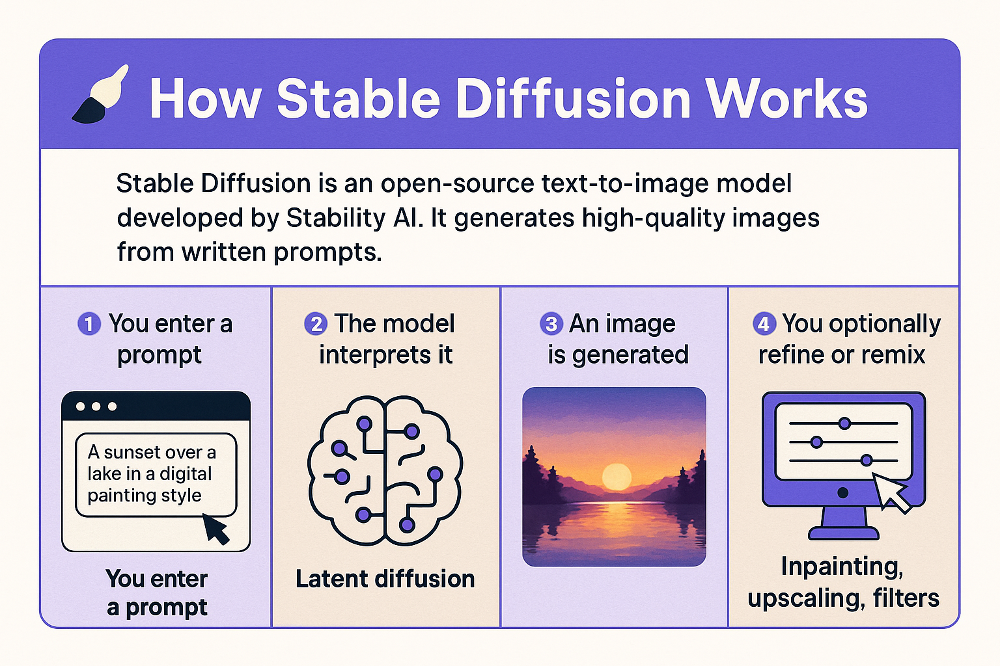

# 🖼️ AI Tools for Image and Video Creation

Welcome to the second session of the **AI Productivity Course**. In this class, we'll explore how AI is transforming the world of **image and video creation**. You'll learn what **Stable Diffusion** is, how generative AI works for visual media, and get hands-on with cutting-edge tools for content creation.

---

## 🎯 Objectives

By the end of this session, you will:

- Understand how image and video generation with AI works
- Learn what Stable Diffusion is and how it's used
- Explore the top AI tools in the market for images, design, and video
- Get inspired to incorporate visual AI into your workflow

---

## 🧠 What is Stable Diffusion?

**[Stable Diffusion](https://stability.ai/stable-diffusion)** is an open-source **text-to-image** model developed by Stability AI. It generates high-quality images from written prompts using a diffusion-based algorithm.

It’s popular because:
- It’s open and customizable
- Can run locally or in the cloud
- Supports advanced styles, fine-tuning, and model extensions (e.g., ControlNet, LoRA)

---

## 🖌️ How Generative AI Creates Images

The process usually looks like this:

1. You enter a **prompt** (e.g. "a futuristic city at sunset in watercolor style")
2. The model interprets it using trained data and **latent diffusion**
3. An image is generated through iterative denoising
4. Optional: refine or remix using inpainting, upscaling, or filters

---

## 🧰 Top AI Tools for Image Generation

| Tool | Description |
|------|-------------|
| [**Midjourney**](https://www.midjourney.com/) | High-quality image generation via Discord. Focus on artistic and cinematic styles. |
| [**DALL·E 3 (OpenAI)**](https://openai.com/dall-e) | Integrated into ChatGPT. Easy to use with clear and consistent image outputs. |
| [**Leonardo AI**](https://leonardo.ai) | Popular among designers and game developers. Includes style presets and asset packs. |
| [**Stable Diffusion Web UI**](https://github.com/AUTOMATIC1111/stable-diffusion-webui) | Self-hosted interface for full control of Stable Diffusion. Ideal for local generation and experimentation. |
| [**DreamStudio**](https://dreamstudio.ai) | Official web platform for Stable Diffusion by Stability AI. Quick and intuitive for beginners. |
| [**Ideogram**](https://ideogram.ai) | AI image generator specialized in text-based art, poster design, and stylish compositions. Great for ad creatives and bold layouts. |
| [**Runway ML**](https://runwayml.com/) | Platform for both image and video generation using GenAI models. Includes creative image filters and inpainting tools. |

---

## 🎥 Top AI Tools for Video Generation

| Tool | Description |
|------|-------------|
| [**Pika Labs**](https://pika.art) | Create short AI-generated videos from text or still images. Fast and evolving. |
| [**Runway Gen-2**](https://runwayml.com/ai-magic-tools/gen-2/) | Leading tool for video generation and transformation. Text-to-video and image-to-video. |
| [**Kaiber**](https://www.kaiber.ai/) | Generate music videos or motion design based on visual prompts and audio tracks. |
| [**Synthesia**](https://www.synthesia.io/) | Create professional AI avatars and voiceovers for training videos, demos, or content. |
| [**D-ID**](https://www.d-id.com/) | Animate still portraits or photos with voice and lip sync. Great for storytelling. |
| [**Captions.ai**](https://www.captions.ai) | AI-powered video editor with automatic subtitles, facial retargeting, voice-over, and scene enhancement — designed for short-form content creators. |

## 📽️ Google AI Video Tools

| Tool | Description |
|------|-------------|
| [**Veo (Google DeepMind)**](https://deepmind.google/technologies/veo/) | Google's most advanced video generation model (announced in 2024). Generates cinematic, high-definition videos from text prompts. Includes camera control, styles, and longer scene coherence. |
| [**Imagen Video**](https://deepmind.google/technologies/imvideo/) | Early-stage video model that creates short videos from text with impressive detail. Veo is its evolution. |
| [**VideoPoet**](https://deepmind.google/technologies/videopoet/) | A multimodal video model that can generate, extend, or stylize videos using text, audio, and motion data. Great for experimental and creative workflows. |
| [**Gemini (formerly Bard)**](https://gemini.google.com) | Google’s general AI assistant. Helps ideate scenes, write scripts, create storyboards, or design prompt workflows for Veo and Imagen. Great as a pre-production co-pilot. |

## Image and Video tools APIs
| Tool | Description |
|------|-------------|
| [**Replicate**](https://replicate.com/) | Run and fine-tune models. Deploy custom models at scale. All with one line of code.|

---

## ✍️ Prompting Tips for Image/Video

- Be **descriptive**: "A surreal dreamscape with floating islands, pastel colors, cinematic lighting"
- Add **style references**: "in the style of Studio Ghibli", "as a watercolor", "ultra-realistic"
- Use **modifiers**: camera angles, lighting, aspect ratio (e.g. "wide shot", "sunset", "4k")
- Use negative prompts (in Stable Diffusion): e.g. "no blur, no distortion"

---

## 🧪 Practice Prompts

1. “A cyberpunk city at night with glowing neon signs — ultra-detailed, anime style”
2. “A nature scene with animals reading books under a tree — watercolor, warm light”
3. “A futuristic interface for a productivity app — isometric view, pastel tones”

---

## ✅ Wrap-Up

These tools can help you:
- Generate illustrations, mockups, or creative assets
- Create visuals for social media, blogs, or branding
- Prototype ideas visually before production
- Animate concepts for storytelling or presentations

---

[⬅ Back to Course Home](../../README.md)
